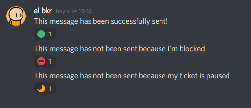

# modmail bot w/mongodb

Discord modmail bot that uses mongo DB. Get in touch with the server members without having to actually do ;)
The user sends a message to the bot and the bot makes the rest.

## Functions
- Send the user message to a channel
- Answer people using a command
- Block users so they won't use the bot, and unblock them if you want
- Pause tickets (in progress)
- Add people into tickets, so you can talk with them.
- Log everything in a logs channel

 

## Contribution
*Suggestions: Making the help command, making the pause and unpause ticket commands, updating to slash commands.*

1. Fork or clone the repo
2. Make your changes
3. Test it and open a pull request

## Setup

The setup of this bot is very simple, just follow the steps

### Creating the application
1. Create an application in [Discord Developer Portal](https://discord.com/developers/applications)
2. Create a bot and copy the token

### Connecting to mongo DB
1. Login or register into [Mongo DB](https://account.mongodb.com/account/login)
2. Create a cluster and complete the configuration
3. Get the connection url by pressing on `connect < connect your application`

### Getting IDs
*Note: Go to discord settings < advanced < enable Developer mode*
1. Go to the server the bot will be in
2. Right click on the sevrer's name and copy the ID
3. Create a category where the tickets will be created in
4. Copy the category ID
5. Create a logs channel and copy the ID

### Get Emojis IDs
1. go to the server the bot is in
2. Add 3 emojis (blocked, correct, paused) *images above* (If you don't want to use different ones, add the images that you will find inside emojis folder
3. Type \ and the emoji
4. You will get something like <a:name:123456678>
5. copy them

### Fill the files
.env file
1. Paste the token and the mongoDB url into `example.env`
2. Rename `example.env` to `.env`

config.json file (inside json folder)
1. Fill the parameters with the IDs that you copied in the previous steps

emojis.json (inside json folder)
1. Paste each ID in it's respective slot

## Running the bot
1. Open the console and run `npm install`
2. Type `node .`
